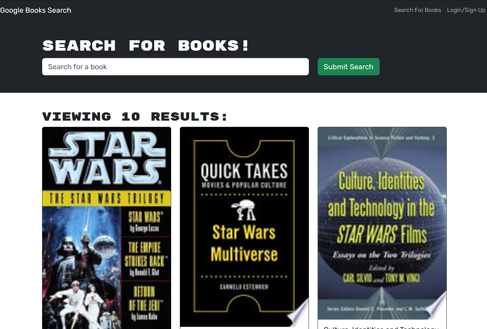

# Book Search Engine

## Description

The Book Search Engine is a web application that allows users to search for books, view book details, and save their favorite books to their profile. It integrates with the Google Books API to fetch book information. 

Link: https://book-search-g445.onrender.com/

## Features

- **User Authentication:** Users can sign up, log in, and log out securely to access personalized features.
- **Search Books:** Users can search for books using keywords or book titles.
- **View Book Details:** Users can view detailed information about each book, including the title, authors, description, and more.

## Technologies Used

- **Frontend:**
  - React
  - Apollo Client for GraphQL

- **Backend:**
  - Node.js
  - Express.js
  - Apollo Server for GraphQL
  - MongoDB with Mongoose ODM

## Installation

1. Clone the repository: `git clone git@github.com:gstroup11/Book-Search-Engine.git`
2. Navigate to the project directory: `cd book-search-engine`
3. Install dependencies for the server: `npm install`
4. Run the build script: `npm run build`
5. Start the application: `npm run develop`

## Usage

1. Open your browser and go to `http://localhost:3001` to access the application.
2. Sign up or log in to use personalized features.
3. Use the search bar to find books.
4. View book details.
5. You can also access the website from the link at the top of this readme.

## Screenshots

## Contributing

Contributions are welcome! If you find a bug or have a feature suggestion, please open an issue or submit a pull request.

## License

This project is licensed under the [MIT License](LICENSE).

## Contact

For inquiries, please contact [Gabe Stroup] at [gstroup11@gmail.com].

